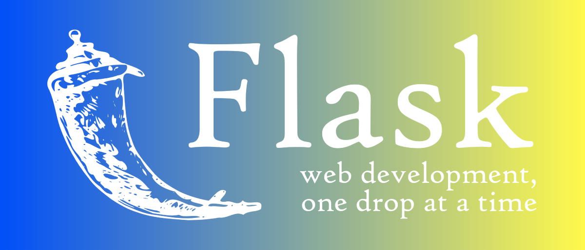

# ProyectoFlask_DesarrolloWEB
Desarrollo WEB con Flask

<h1><strong>Desarrollo WEB con Flask</strong></h1>
<h3><strong>Proyecto Web con Flask</strong></h3>

  

<strong>Instalacion de Flask</strong>

Flask en un framework de desarrollo WEB con Python que es otro framework, es un framework mas sencillo que es Flask y mucho menos complejo en general, no tan complicado como lo es el framework de Django que se utiliza para casos concretos para aplicaciones WEB rapidas asi como vamos a aprender a trabajar con Flask a partir de ahora lo que vamos a aprender es realizar la instalacion de Flask primeramente lo que tienes que hacer es abrir la consola de comandos de Windows 10 y comprobar que se tenga instalado Python, para ello desde la ventana de comandos de la consola digital

c:\Users\Lenovo>python --version

  

Ahora para instalar Flask desde la misma consola de comandos de windows ponemos

c:\Users\Lenovo>pip install Flask

  

Mayor informacion desde la pagina WEB:

https://flask.palletsprojects.com/en/1.1.x/installation/#install-flask

pero como ya la tengo instalado va aparecer unos mensajes de ya instalado.

Dentro de Visual Studio Code en la carpeta de proyecto en donde se guarda en c:\wamp64\www\23-flask> va a crear un archivo que se llama main.py que es el archivo principal del proyecto de Flask

En el archivo de main.py (Flask), para poder trabajar con flak va a ir lo siguiente:

from flask import Flask

app = Flask(__name__)

if __name__ == '__main__:
     app.run(debug=True)
     
     
 Para crear una ruta en el mismo archivo con simplemente poner
 @app.route('/')
 
 def index():
     return "Aprendiendo Flask con Lcdo. Jose Fernando Frugone Jaramillo"
     
     
 que quedaria asi el archivo "main.py"
 
 from flask import Flask
 
 app = Flask(__name__)
 
 @app.route('/')
 
 def index():
     return "Aprendiendo Flask con el Lcdo. Jose Fernando Frugone Jaramillo" 
 
 if __name__ == '__main__':
     app.run(debug=True)
     

Para ejecutar el proyecto de Flask desde la consola de camandos de Windows digitamos lo siguiente:

c:\wamp64\www\Curso_Udemy_Master_Python\23-flask>python main.py y nos apararece lo siguiente adjunto pantalla

  

  

<strong>Crear Rutas</strong>

Bien una vez que ya se ha instalado Flask vamos a trabajar con la creacion de rutas dentro de Flask

Te adjunto el archivo main.py donde estan las diferentes rutas del proyecto de Flask y para manejo de las tablas de Mysql

from flask import Flask, flash, redirect, url_for, render_template, request
from datetime import datetime
from flask_mysqldb import MySQL

app = Flask(__name__)

app.secret_key = 'clave_secreta_flask'

# Conexion con la base de datos
app.config['MYSQL_HOST'] = 'localhost'
app.config['MYSQL_USER'] = 'root'
app.config['MYSQL_PASSWORD'] = ''
app.config['MYSQL_DB'] = 'proyectoflask'

mysql = MySQL(app)

# Comntext processor

@app.context_processor
def date_now():
    return {
        'now': datetime.utcnow()
    }

# end points

@app.route('/')

def index():
    
    info = "Inicio"
    title = "Pagina de inicio de Proyecto Flask"
    edad = 50
    personas = ['Victor', 'Paco', 'Francisco', 'Raul', 'Andres', 'Paul']
    
    return render_template('index.html',
                            info=info,
                            title=title,
                            personas=personas,
                            edad=edad)

@app.route('/informacion')
@app.route('/informacion/<string:nombre>/<string:apellidos>')

def informacion(nombre=None, apellidos=None):
    
    texto = ""

    nombre = 'Lcdo. Jose Fernando'
    apellidos = 'Frugone Jaramillo'

    if nombre != None and apellidos != None:

        texto = f"""
                 <h1> Informacion </h1>
                 
 Pagina de informacion 

                 <h3>Bienvenido, {nombre} {apellidos} </h3>  

                """ 

        return render_template('informacion.html',
                                texto=texto,
                                title="informacion")

    texto = f"""
               <h1> Informacion </h1>
               
 Pagina de Informacion 

               <h3> Bienvenido, {nombre} {apellidos} </h3>
             """
   

    return render_template('informacion.html',
                            texto=texto,
                            title="Informacion")

@app.route('/contacto')
@app.route('/contacto/<string:redireccion>')

def contacto(redireccion = None):

    if redireccion != None:

        return redirect(url_for('lenguajes'))

    info = "Contacto"
    texto = "<h3> Pagina de Contacto </h3>"
    texto2 = "<h1> Aprendiendo Flask con Victor Robles"

    return render_template('contacto.html',
                            texto=texto,
                            texto2=texto2,
                            info=info) 
   

@app.route('/lenguajes')

def lenguajes():

    info = "Lenguajes"
    texto = "<h3> Pagina de Lenguajes </h3>"
    title = "<h2> Aprendiendo Flak con Victor Robles </h2>"

    return render_template('lenguajes.html', texto=texto, info=info, title=title) 

@app.route('/insertar_coche', methods=['GET', 'POST'])

def insertar_coche():

    if request.method == 'POST':

        marca = request.form['marca']
        modelo = request.form['modelo']
        precio = request.form['precio']
        ciudad = request.form['ciudad']

        cursor = mysql.connection.cursor()
        cursor.execute("INSERT INTO coches(id, marca, modelo, precio, ciudad) VALUES(null, %s, %s, %s, %s)",(marca,modelo,precio,ciudad))
        cursor.connection.commit()

        flash('Has creado el coche correctamente!!!!')
        
        return redirect(url_for('index'))

    return render_template('crear_coche.html',title="Crear Coche")

@app.route('/crea_articulo', methods=['GET', 'POST'])

def crea_articulo():

    if request.method == 'POST':

        marca = request.form['marca']
        modelo = request.form['modelo']
        precio = request.form['precio']

        cursor = mysql.connection.cursor()
        cursor.execute("INSERT INTO articulos(id, marca, modelo, precio) VALUES(null, %s, %s, %s)", (marca, modelo, precio))
        cursor.connection.commit()

        flash('Has creado el articulo correctamente')

        return redirect(url_for('index'))

    return render_template('crear_articulo.html', title="Crear Articulo")    

@app.route('/coches')
def coches():
    cursor = mysql.connection.cursor()
    cursor.execute("SELECT * FROM coches")

    coches = cursor.fetchall()
    cursor.close()

    return render_template('coches.html', coches=coches, title="Listado de Coches")

@app.route('/lista_articulos')
def lista_articulos():
    cursor = mysql.connection.cursor()
    cursor.execute("SELECT * FROM articulos")

    articulos = cursor.fetchall()
    cursor.close()

    return render_template('articulos.html', articulos=articulos, title="Listado de Articulos")

@app.route('/detalle_coches/<coche_id>')
def detalle_coches(coche_id):
    cursor = mysql.connection.cursor()
    cursor.execute("SELECT * FROM coches WHERE id = %s", coche_id)

    coches = cursor.fetchall()
    cursor.close()

    return render_template('detalle.html', coches=coches, title="Detalle de Coche")

@app.route('/detalle_articulo/<articulo_id>')
def detalle_articulo(articulo_id):
    cursor = mysql.connection.cursor()
    cursor.execute("SELECT * FROM articulos WHERE id = %s", articulo_id)

    articulos = cursor.fetchall()
    cursor.close()

    return render_template('detalle_art.html', articulos=articulos, title="Detalle de  Articulos") 

@app.route('/borrar_coches/<coche_id>')
def borrar_coches(coche_id):
    cursor = mysql.connection.cursor()
    cursor.execute("DELETE FROM coches WHERE id = %s", coche_id)
    mysql.connection.commit()

    flash('El coche ha sido eliminado !!!')
    
    return redirect(url_for('index'))

@app.route('/borrar_articulo/<articulo_id>')
def borrar_articulo(articulo_id):
    cursor = mysql.connection.cursor()
    cursor.execute("DELETE FROM articulos WHERE id = %s", articulo_id)
    mysql.connection.commit()

    flash('El articulo ha sido eliminado !!!')

    return redirect(url_for('index'))

@app.route('/editar_coches/<coche_id>', methods=['GET', 'POST'])

def editar_coches(coche_id):

    if request.method == 'POST':

        marca = request.form['marca']
        modelo = request.form['modelo']
        precio = request.form['precio']
        ciudad = request.form['ciudad']

        cursor = mysql.connection.cursor()
        cursor.execute("""
               UPDATE coches
                SET marca = %s,
                    modelo = %s,
                    precio = %s,
                    ciudad = %s
                WHERE id = %s    

        """, (marca, modelo, precio, ciudad, coche_id))
        cursor.connection.commit()

        flash('Has editado el coche correctamente....!')

        edad = 50
        
        return redirect(url_for('index'))

    cursor2 = mysql.connection.cursor()
    cursor2.execute("SELECT * FROM coches WHERE id = %s", (coche_id))

    coches = cursor2.fetchall()

    edad = 50
    
    return render_template('crear_coche.html',
                            title='Crear coche',
                            info='Coches',
                            edad=edad,
                            coches=coches)

@app.route('/editar_articulo/<articulo_id>', methods=['GET', 'POST'])

def editar_articulo(articulo_id):

    if request.method == 'POST':

        marca = request.form['marca']
        modelo = request.form['modelo']
        precio = request.form['precio']

        cursor = mysql.connection.cursor()
        cursor.execute("""
               UPDATE articulos
                SET marca = %s,
                    modelo = %s,
                    precio = %s
                WHERE id = %s    

        """, (marca, modelo, precio, articulo_id))
        cursor.connection.commit()

        flash('Has editado el articulo correctamente....!')

        edad = 50
        
        return redirect(url_for('index'))

    cursor2 = mysql.connection.cursor()
    cursor2.execute("SELECT * FROM articulos WHERE id = %s", (articulo_id))

    articulos = cursor2.fetchall()

    edad = 50
    
    return render_template('crear_articulo.html',
                            title='Crear Articulo',
                            info='Articulos',
                            edad=edad,
                            articulos=articulos)

   
    
@app.route('/coche_unico/<coche_id>')
def coche_unico(coche_id):
    cursor = mysql.connection.cursor()
    cursor.execute("SELECT * FROM coches WHERE id = %s",coche_id)

    coches = cursor.fetchall()
    cursor.close()

    return render_template('crear_coche.html', coches=coches, title="Crear/Editar Coche")

    
if __name__ == '__main__':
    app.run(debug=True)
    
   
<h3>
<strong>Routing y vistas con Flask</h3></strong>

<strong>Rutas con parametros</strong>

Para establecer las rutas con parametros en la parte de la definicion de las rutas a lo que define la ruta con @app.route('/informacion/<string:nombres>/<string:apellidos>'), definimos los parametros con los simbolos menor que y mayor que dentro de estos simbolos especificando el tipo de dato que va a tener este parametro, asi en el archivo "main.py" del proyecto 'Flask' en la ruta informacion pasamos 2 parametros que son los nombres y los apellidos, asi:

@app.route('/informacion')
@app.route('/informacion/<string:nombre>/<string:apellidos>')

def informacion(nombre=None, apellidos=None):
    
    texto = ""

    nombre = 'Lcdo. Jose Fernando'
    apellidos = 'Frugone Jaramillo'

    if nombre != None and apellidos != None:

        texto = f"""
                 <h1> Informacion </h1>
                 
 Pagina de informacion 

                 <h3>Bienvenido, {nombre} {apellidos} </h3>  

                """ 

        return render_template('informacion.html',
                                texto=texto,
                                title="informacion")

    texto = f"""
               <h1> Informacion </h1>
               
 Pagina de Informacion 

               <h3> Bienvenido, {nombre} {apellidos} </h3>
             """
   

    return render_template('informacion.html',
                            texto=texto,
                            title="Informacion")

<strong>Parametros opcionales</strong>

@app.route('/informacion')
@app.route('/informacion/<string:nombre>/<string:apellidos>')

def informacion(nombre=None, apellidos=None):
    
    texto = ""

    nombre = 'Lcdo. Jose Fernando'
    apellidos = 'Frugone Jaramillo'

    if nombre != None and apellidos != None:

        texto = f"""
                 <h1> Informacion </h1>
                 
 Pagina de informacion 

                 <h3>Bienvenido, {nombre} {apellidos} </h3>  

                """ 

        return render_template('informacion.html',
                                texto=texto,
                                title="informacion")

    texto = f"""
               <h1> Informacion </h1>
               
 Pagina de Informacion 

               <h3> Bienvenido, {nombre} {apellidos} </h3>
             """
   

    return render_template('informacion.html',
                            texto=texto,
                            title="Informacion")
    

<h3><strong>Layout, bloques y herencias de templates</strong></h3>

El layout.html va hacer la pagina que ha a servir de molde para las demas paginas, que se basa el proyecto WEB de Flask, para los bloques en la pagina lo definimos asi   dentro de estas etiquetas, asi:

<!DOCTYPE HTML>
<html lang="es">
      <head>
          <meta charset="utf-8" />
          <title> Master en Python - Flask  | Aprendiendo Flask con Victor Robles</title>
          <link rel="stylesheet" href="{{ url_for('static', filename='css/styles.css')}}" 
      </head>
      <body>

           <header>
                

                    <!-- Logo Django-->
                    
                    <h1>Aprendiendo Flask con Victor Robles!!!</h1>

                

            </header>

               <nav>
            
                <ul>
                   <li>
                      <a href="/">Inicio</a>
                   </li>
                   <li>
                      <a href="{{ url_for('insertar_coche') }}">Crear coche</a>
                   </li>
                   <li>
                      <a href="{{ url_for('coches') }}">Listado de coches</a>
                   </li>
                   <li>
                      <a href="{{ url_for('lista_articulos') }}">Listado de articulos</a>
                   </li>
                   <li>
                      <a href="{{ url_for('crea_articulo') }}">Crear articulos</a>
                   </li>
                   <li>
                      <a href="{{ url_for('informacion') }}">Informacion</a> 
                   </li>
                   <li>
                      <a href="{{ url_for('contacto') }}">Contacto</a> 
                   </li>
                   <li>
                      <a href="{{ url_for('lenguajes') }}">Lenguajes</a> 
                   </li>
                </ul>
               </nav> 

            
           

           
           

               

                  
                  
                  <!-- Codigo que viene del template-->
                  
                  
                  <!-- El mapa va en otro lugar -->

                  

               
       
        
            

            
          <footer>
               Master en Python por Victor Robles &copy; Lcdo. Jose Frugone {{now.day}}/{{now.month}}/{{ now.year }}
          </footer>    
                
      </body>

      
</html>

<strong>Bloques y herencias</strong>

  
Para los demas templates asi definimos, por ejemplo en el templates 'informacion.html' degfinimos asi:



{{title}}



    <h1>Pagina de informacion</h1>
    
 Esta es la pagina de informacion 

    <h3>{{texto|safe}}</h3> 



y asi para todos los templates

ahora bien para el manejo de las bases de datos te adjunto el codgo para que veas como esta codificado y veas el proyecto de "Flask"

<h3><strong>Desarrollo web con Flask paso a paso - Bases de datos y formularios</strong>

<strong>Crear base de datos</strong>

A partir de ahora vamos a estar trabajando con una aplicacion completa vamos a crear una base de datos antes de nada debes de tener instalado Mysql en tu maquina para ellos puedes tener instalado wampserver que trae el mysql en el caso que ya tengas inslado wampserver debes de abrir mysql de la barra de tareas de windows y donde esta corriendo la aplicacion del servicio del administrador de wampserver debes de correr phpMyadmin, que te aparece la siguiente pantalla:

  

creamos las tablas que se llama coches y articulos, definiendo sus campos, tipo de dato, ancho, tenemos asi la pantalla:

  

<strong>Conexion a la base de datos mysql</strong>

para establecer la conexion con la base de datos del proyecto de Flask con Mysql, desde el motor de busqueda de google www.google.com ponemos flask mysqldb y entramos a la siguiente pagina oficial del conector:

https://flask-mysqldb.readthedocs.io/en/latest/

debes instalar el paquete con pip install flask-mysqldb y desde el archivo del proyecto de Flask 'main.py' para poderlo utilizar debes de importarlo asi de esta manera from flask_mysqldb import MySQL

# Conexion con la base de datos
app.config['MYSQL_HOST'] = 'localhost'
app.config['MYSQL_USER'] = 'root'
app.config['MYSQL_PASSWORD'] = ''
app.config['MYSQL_DB'] = 'proyectoflask'

mysql = MySQL(app)

<strong>Insertar datos</strong>

Para poder insertar datos a la tabla coches, articulos (nos basamos en base a la tabla coches) asi:

@app.route('/insertar_coche', methods=['GET', 'POST'])

def insertar_coche():

    if request.method == 'POST':

        marca = request.form['marca']
        modelo = request.form['modelo']
        precio = request.form['precio']
        ciudad = request.form['ciudad']

        cursor = mysql.connection.cursor()
        cursor.execute("INSERT INTO coches(id, marca, modelo, precio, ciudad) VALUES(null, %s, %s, %s, %s)",(marca,modelo,precio,ciudad))
        cursor.connection.commit()

        flash('Has creado el coche correctamente!!!!')
        
        return redirect(url_for('index'))

    return render_template('crear_coche.html',title="Crear Coche")
    
  
<strong>Formulario para crear coche</strong>

  
  Para crear el formulario para este caso crear el coche dentro del archivo 'main.py' del proyecto tenemos un metodos que se llama 'insertar_coche'; y lo definimos de esta manera:
  
  
  @app.route('/insertar_coche', methods=['GET', 'POST'])

def insertar_coche():

    if request.method == 'POST':

        marca = request.form['marca']
        modelo = request.form['modelo']
        precio = request.form['precio']
        ciudad = request.form['ciudad']

        cursor = mysql.connection.cursor()
        cursor.execute("INSERT INTO coches(id, marca, modelo, precio, ciudad) VALUES(null, %s, %s, %s, %s)",(marca,modelo,precio,ciudad))
        cursor.connection.commit()

        flash('Has creado el coche correctamente!!!!')
        
        return redirect(url_for('index'))

    return render_template('crear_coche.html',title="Crear Coche")
    
y dentro de la carpeta de templates tenemos el template 'crear_coche.html' que lo tenemos de la siguiente manera:



{{title}}



    
    

       
           <h1>Editar coche: {{coche.1}} {{coche.2}}</h1>
       
    
       <h1>{{title}}</h1> 
    
    
    <form action="" method="POST">
    
        <label for="marca">Marca</label>
        <input type="text" name="marca" placeholder="marca" maxlenght=50   value="{{coche.1}}"  />

        <label for="modelo">Modelo</label>
        <input type="text" name="modelo" placeholder="modelo" maxlenght=30   value="{{coche.2}}"   />

        <label for="precio">Precio</label>
        <input type="number" name="precio" placeholder=0.00   value="{{coche.3}}"   />

        <label for="ciudad">Ciudad</label>
        <input type="text" name="ciudad" placeholder="ciudad" maxlenght=80   value="{{coche.4}}"   />

        <input type="submit" value="Guardar" />

    </form>
    
    


